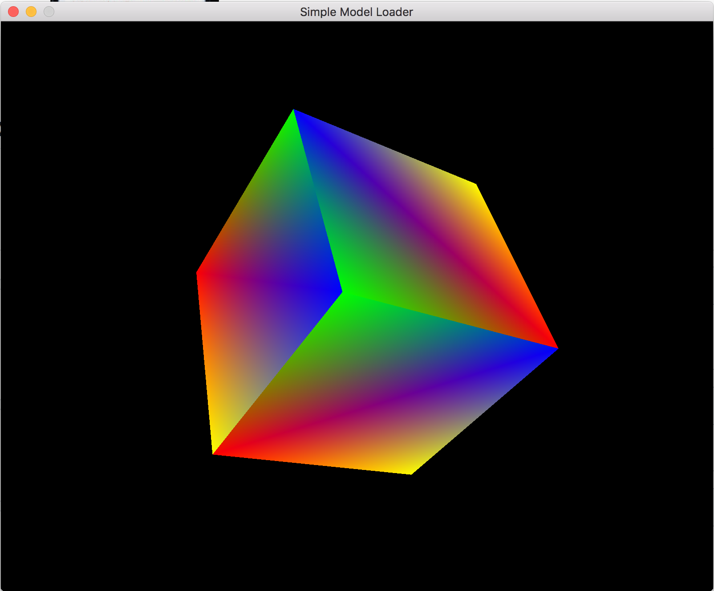

## simple_model_loader

The purpose of this project is to create a simple 3D model loader that will read in our own custom file type (.MODEL) that will contain the vertex and element data that defines our models.

The format of the data is as follows:
Vertex data(v): x, y, z, r, g, b, nx, ny, nz (where nx, ny, and nz are the normal values) 
The element data(e) will be indices referencing the individual vertices.

Example file data: 
v 0.0 0.0 0.0 1.0 0.0 0.0 0.0 0.0 1.0 
v 1.0 0.0 0.0 1.0 0.0 0.0 0.0 0.0 1.0 
v 1.0 1.0 0.0 1.0 0.0 0.0 0.0 0.0 1.0 
...

e 0 1 2 
e 1 2 3

To build this project there is an included Makefile within the src folder, though you'll probably have to update the compilation and linking flags (CXX, CXXFLAGS, LDFLAGS) to reference the dependencies on OpenGL, GLFW and GLM.

